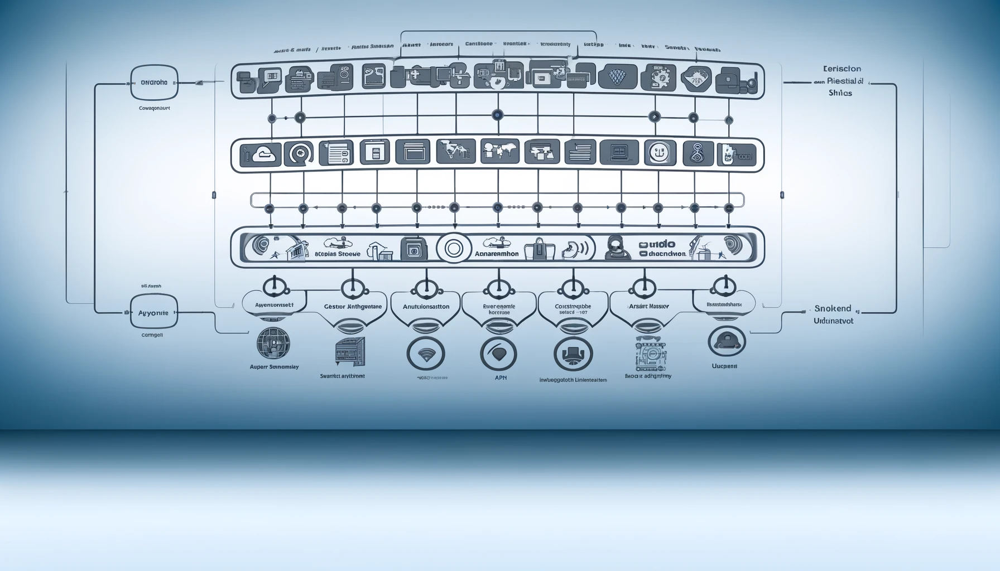

# Gestión de Productos y Servicios

## Contenido

- [Introducción](#introducción)
- [Prerrequisitos](#prerrequisitos)
- [Instalación](#instalación)
- [Uso](#uso)
- [Cómo Contribuir](#cómo-contribuir)
- [Requisitos del Sistema](#re)
- [Licencia](#licencia)

## Introducción

El presente respositorio (monorepo) contiene un proyecto de gestión de categorías, productos, inventario y precios separados en microservicios.

Este proyecto es un ejercicio realizado con el fin de mostrar a algunos jóvenes colegas una aproximación de cómo se puede resolver este tipo de necesidades, aclaro, es una de muchas formas posibles, y, cómo la arquitectura se puede ir evolucionando con el tiempo.

Ocasionalmente alguien me contacta por [Linkedin] o por medio de otro amigo, para realizarme alguna consulta sobre cómo hacer tal o cual cosa en un sistema, así que, motivado por estas consultas, he decidido crear un pequeño sistema dividido en microservicios, que responde a esas preguntas que ocasionalmente he respondido.

No es un sistema exhaustivo,seguro en el tintero quedarán muchas más cosas que contar, pero trataremos ir respondiendo preguntas por medio de este proyecto.

## Prerrequisitos

Este proyecto y los documentos asociados, incluyendo guías, artículos y ejemplos de código, asumen que el lector tiene conocimientos fundamentales en programación y lógica, así como una comprensión sólida del entorno de ejecución Node.js y los lenguajes JavaScript y TypeScript. Este material se centra en principios, patrones y buenas prácticas de desarrollo de software, por lo que no se abordarán los conceptos básicos de estos lenguajes y tecnologías. Asegúrate de estar familiarizado con estos aspectos antes de proceder.

### Tecnologías

Acontinuación se listan las tecnologías empleadas en el desarrollo y ejecución del proyecto:

Los microservicios serán desarrollados en su totalidad con [TypeScript][ts] para ser ejecutado en [NodeJS][node] y utilizando [Express][express] para la gestión de las peticiones HTTP,

- [Docker][docker]: Docker permite encapsular aplicaciones en contenedores que luego puden ser ejecutadas en cualquier ambien en el cual se tenga Docker instalado, dando una gran portabilidad a las aplicaciones eliminando así la necesidad de modificar el código para adaptarlo a distintas plataformas.
- [Docker Compose][compose]: docker-compose, es un orquestador de contenedores docker, excelente para probar varios microservicios en entorno local, no recomendado para entornos productivos, aún cuando se utiliza en tales casos para proyectos muy pequeños.
- [Express][express]: Es un mini framework para desarrollo de servicios HTTP, no es el único, pero si uno de los más utilizados.
- [Git][git]: Considerado actualmente la herramienta por excelencia para el control de versiones de nuestros desarrollos, e igualmente utilizados por otros profesionales de otras áreas.
- [GitHub][github]: Es uno de los servicios en la nube para guardar nuestros proyectos con git.
- [MongoDB][mongo]: Sistema de Gestion de Base de Datos del grupo NoSQL o Orientado a Documentos muy utilizado en la actualidad.
- [Neo4j][neo4j]: Base de datoa Orientada a Grafos (GDBMS), es una base de datos documentación, en la cual, las relaciones son ciudadanos de primer orden y incluyen información sobre la relación entre dos nodos.
- [NodeJS][node]: Entorno de ejecución de programas desarrollados en JavaScript
- [TypeScript][ts]: Será el lenguaje empleado para escribir todo el código para Node.js, que luego será transpilado, ya que Node.js solo comprende [JavaScript][js]

## Instalación

Antes de instalar el proyecto en nuestro equipo, se requiere contar con algunas herramientas previamente instaladas, como en la mayoría de los casos, la instalación difiere de una plataforma a otra y, el proceso escapa de la cobertura de este proyecto, les dejaré los requerimientos mínimos y el link a sus respectivas páginas para que se remitan a la documentación y puedan ver cual es el proceso de instalación.

Para instalar este proyecto y comenzar a usarlo, sigue los pasos detallados a continuación:

1. **Clonar el repositorio**

```sh
git clone git@github.com:jeastman19/products-example.git
```

## Uso

Para desplegar en local el proyecto en su totalidad, utilizamos en [docker-compose][compose]

```
docker-compose up -d
```

## Cómo Contribuir

Aprecio tu interés en contribuir a este proyecto. Tanto si eres un estudiante que está aprendiendo, como un profesional experimentado, tu participación es bienvenida. Aquí te explico cómo puedes contribuir y qué beneficios podríamos obtener juntos:

1. **Mejorando el Código**: Si ves alguna manera de mejorar el código, optimizar procesos o implementar nuevas funcionalidades, no dudes en forkear el repositorio y enviar tus pull requests. Asegúrate de describir claramente los cambios y sus beneficios.

2. **Escribiendo y Mejorando Documentación**: La documentación clara y completa es vital para cualquier proyecto. Si puedes añadir ejemplos, explicaciones o clarificar los textos existentes, tu contribución será muy valiosa.

3. **Respondiendo a Preguntas**: Si tienes respuestas a las preguntas que otros han publicado en los issues, por favor, comparte tu conocimiento. Esta es una gran manera de ayudar a otros a resolver problemas y aprender.

4. **Feedback y Sugerencias**: Tus comentarios sobre el proyecto son muy importantes. Esto no solo me ayuda a mejorar mis habilidades y el proyecto en sí, sino que también me permite conocer nuevas perspectivas y técnicas.

5. **Compartiendo Experiencias**: Si este proyecto te ha ayudado de alguna manera, me encantaría escuchar tu historia. Puedes escribir sobre cómo has usado el proyecto o los artículos en LinkedIn, mencionarme, y compartir tu experiencia. Esto puede ayudar a otros a ver los posibles usos y beneficios del proyecto.

6. **Proponiendo Nuevos Temas para Artículos**: Si hay aspectos o tecnologías que te gustaría que explorara y sobre los cuales escribiera, por favor házmelo saber. Tus preguntas pueden ser el inicio de un nuevo artículo que beneficie a muchos.

### Beneficios de Contribuir

Contribuir a este proyecto no solo te ayudará a mejorar tus habilidades técnicas y de comunicación, sino que también te permitirá formar parte de una comunidad que valora el aprendizaje abierto y la mejora continua. Además, puede aumentar tu visibilidad profesional y abrir nuevas oportunidades laborales.

## Requisitos del Sistema

Con el fin de ayudar a comprender mejor lo que el sistema hace (o más bien, debería hacer), se agregan una serie de documentos en los cuales se analizan los [requisitos funcionales y no funcionales][requisitos] del proyecto.

## Licencia

Este proyecto está licenciado bajo la Licencia MIT. Esto significa que tienes amplia libertad para distribuir, modificar, incluir en proyectos privados y más, siempre y cuando incluyas el archivo original de la licencia y los derechos de autor en cualquier distribución. Para más información, consulta el archivo [LICENSE][license] en este repositorio.

[compose]: https://docs.docker.com/compose/
[docker]: https://www.docker.com/
[express]: https://expressjs.com/es/
[git]: https://git-scm.com/
[github]: https://github.com/
[js]: https://developer.mozilla.org/es/docs/Web/JavaScript
[license]: ./LICENSE
[mongo]: https://www.mongodb.com/es
[node]: https://nodejs.org/en
[neo4j]: https://neo4j.com/
[ts]: https://www.typescriptlang.org/
[requisitos]: ./documentation/001%20-%20requisitos.md
